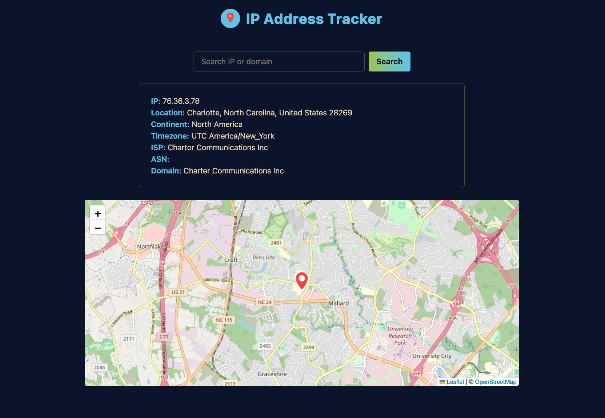
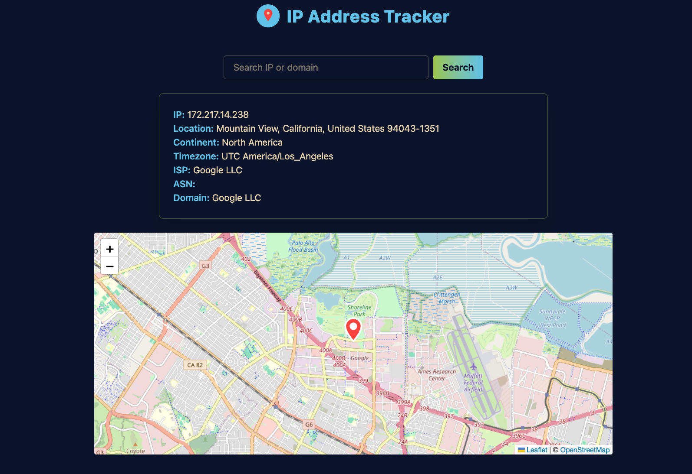
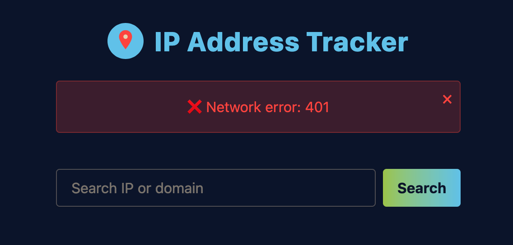

# 🛰️ IP Address Tracker

IP Address Tracker is a responsive web application built with **React**, **TypeScript**, and **Context API**. It integrates the **IPify Geolocation API** to fetch IP address details and displays them dynamically on an interactive **Leaflet map**.  Designed for modern devices with smooth animations via **Framer Motion**.


---

## 🚀 Features

- 🌐 **IP Geolocation Lookup**: Fetches IP address data and displays location, ISP, timezone, and IP.
- 🗺 **Interactive Map**: Uses Leaflet to pinpoint the IP location on a dynamic map.
- 🔎 **Search Functionality**: Look up any IP address or domain to see live results.
- 🎨 **Fully Responsive**: Adapts gracefully across desktops, tablets, and mobile.
- ✨ **Animated UI**: Smooth transitions and micro-interactions with Framer Motion.
- ♿ **Accessible**: Follows best practices for keyboard and screen reader navigation.

---

## 🚢 Live Deployment
Coming soon..

## 🚀 Local Setup & Tailwind CSS Installation

To set up and run this project locally with Tailwind CSS and Vite:

1. **Clone the repository**

```bash
git clone https://github.com/YusufBolden/ip-address-tracker.git
cd ip-address-tracker
```

2. **Install project dependencies**

```
npm install
```

3. **Install Tailwind CSS (with Vite)**

```
npm install tailwindcss @tailwindcss/vite
```

4. **Configure the Vite plugin**

```
// vite.config.ts
import { defineConfig } from 'vite'
import tailwindcss from '@tailwindcss/vite'

export default defineConfig({
  plugins: [
    tailwindcss(),
  ],
})
```

5. **Import Tailwind in your CSS file**

```
/* src/index.css */
@import "tailwindcss";
```
6. **Create a `.env`:**

```
VITE_IP_GEO_KEY=your_api_key_here
```

7. **Start the dev server**

```
npm run dev
```

---

## 🗄️ File Structure
```
ip-address-tracker/
├── index.html
├── package.json
├── tsconfig.json
├── tsconfig.node.json
├── tailwind.config.ts
├── vite.config.ts
├── README.md
├── index.css
├── public/
│   ├── favicon.png
│   ├── screenshot.png
│   ├── screenshot.png
│   ├── screenshot.png
└── src/
    ├── main.tsx
    ├── App.tsx
    ├── pages/
    │   └── HomePage.tsx
    ├── components/
    │   ├── IPForm.tsx
    │   ├── IPDetails.tsx
    │   └── IPMap.tsx
    ├── context/
    │   ├── IPContext.tsx
    │   └── useIP.ts
    ├── hooks/
    │   └── useLocalStorage.ts
    └── types/
        └── index.ts
```
---

## 📸 Previews

### Home Page


### Search Details


### Network Error

---

## 📝 Reflection Document

This project pushed me to balance visual appeal with technical precision. From the outset, I prioritized designing a fluid, intuitive user experience using Tailwind CSS for rapid styling and Framer Motion to add subtle, lively transitions. Structuring state was critical; leveraging Context API kept the IP data easily accessible across deeply nested components without prop drilling, improving maintainability.

A significant challenge was reconciling inconsistent data models across IP geolocation APIs. Each provider returned unique structures, with some omitting key fields like ASN or even latitude/longitude under certain conditions. This meant carefully designing defensive code to verify data before updating state, ensuring the map never received invalid coordinates. Implementing error boundaries, complete with user-dismissible alerts, was a direct outcome of this, keeping the interface robust even when APIs failed.

Another subtle hurdle was achieving both accessibility and aesthetic balance. Tailwind made responsive design straightforward, but fine-tuning focus rings and ARIA labels to maintain WCAG accessibility while also staying visually minimal took careful iteration. I also spent time refining hover states so they felt engaging but not overly playful for a utility-style tracker.

As the build matured, attention shifted to micro-interactions and polish easing curves in Framer Motion, matching the map pin and favicon colors for thematic cohesion, and ensuring dismissible errors didn’t disrupt animations. If I were to evolve this project further, I’d implement a theme toggle with persistent local storage to honor user preferences, and potentially integrate a street-level imagery view for richer context. Overall, this project solidified my end-to-end process from data fetching to animation, reinforcing a focus on graceful degradation and seamless UX.

## 🐞 Common Errors & Resolutions

1. API returned incomplete data

  - Ensured API selected was ipgeolocation.io and checked JSON for missing fields.

2. Invalid LatLng object

  - Added guards to prevent Leaflet from rendering if latitude or longitude were undefined.

3. 429 Too Many Requests

  - Added alert UI to inform the user and let them try again later.

4. Favicon background clash

  - Iterated custom vector design to match the app color palette and remove unexpected backgrounds.

5. Subtle hover effects felt weak

  - Enhanced with more dramatic scaling and transition durations.

---

## 🧑🏿‍💻 Author

Created by [Yusuf Bolden](https://github.com/YusufBolden). Feedback and suggestions are welcome!

---

## 📄 License

This project is licensed under the [MIT License](https://opensource.org/licenses/MIT).
